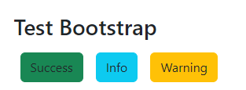
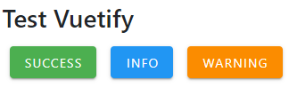
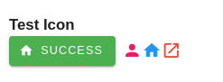
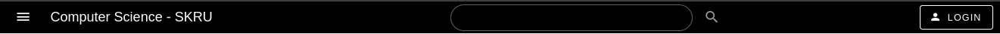
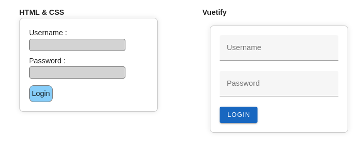
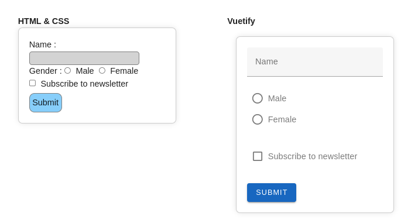
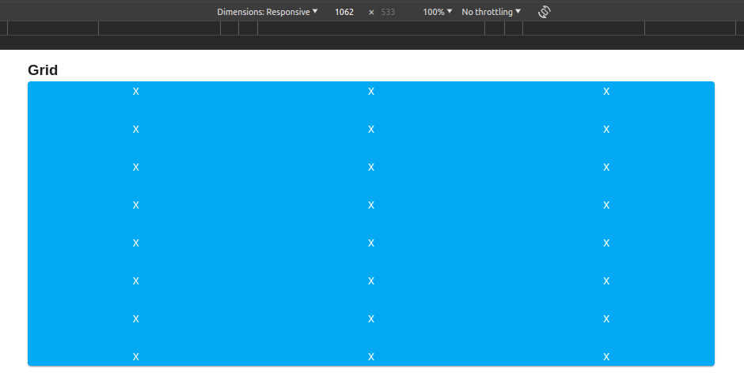
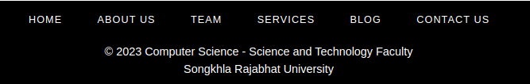
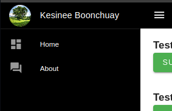

## การใช้ Boostrap ใน Vue

1) สร้างโปรเจ็ค Vue ใหม่

2) ติดตั้ง package ของ bootstrap

```
npm install bootstrap
npm install @popperjs/core
```

3) เพิ่มการเรียกใช้ในไฟล์ src/main.js

```
import 'bootstrap/dist/css/bootstrap.css'
import "bootstrap"
```

4) ทดสอบโดยเพิ่มโค้ด

```
 <div class="container">
     <button type="button" class="btn btn-success">Success</button>
     <button type="button" class="btn btn-info">Info</button>
     <button type="button" class="btn btn-warning">Warning</button>
  </div>
```





## การใช้  Vuetify ใน Vue

1) สร้างโปรเจ็ค Vue ใหม่

2) ติดตั้ง package ของ Vuetify

```
npm i vuetify
```

3) เพิ่มการเรียกใช้ในไฟล์ src/main.js

```
// Vuetify
import 'vuetify/styles'
import { createVuetify } from 'vuetify'
import * as components from 'vuetify/components'
import * as directives from 'vuetify/directives'

const vuetify = createVuetify({
  components,
  directives,
})

const app = createApp(App)
app.use(vuetify)
app.mount('#app')
```

4) ทดสอบโดยเพิ่มโค้ด
```
<v-container>
    <h3>Test Vuetify</h3>
    <v-btn color="success" class="mr-2"> Success </v-btn>
    <v-btn color="info" class="mr-2"> Info </v-btn>
    <v-btn color="warning" class="mr-2"> Warning </v-btn>
    <v-btn color="light-blue" class="mr-2"> light-blue </v-btn>
</v-container>
```




5) การใช้ icon ของ vuetify เพิ่มโค้ดใน src/main.js

```
import { aliases, mdi } from 'vuetify/iconsets/mdi'
import '@mdi/font/css/materialdesignicons.css' 

export default createVuetify({
  icons: {
    defaultSet: 'mdi',
    aliases,
    sets: {
      mdi,
    },
  },
})
```

6) ทดสอบการใช้ icon
```
<v-container>
    <h3>Test Icon</h3>
    <v-btn prepend-icon="mdi-home" color="success" class="mr-2">
        Success
    </v-btn>
    <v-icon icon="mdi-account" color="pink" />
    <v-icon icon="mdi-home" color="info" />
    <v-icon icon="mdi-open-in-new" color="red"></v-icon>
</v-container>
```



## สร้าง Layout ง่าย ๆ โดยใช้ Vuetify 

### 1) สร้างโครงส้าง template ในไฟล์ src/App.vue ดังนี้

```
<template>
    <v-app>
        <v-main>

            <!-- drawer -->

            <!-- toolbar -->

            <!-- Comparation between HTML & CSS and Vuetify #1 -->

            <!-- Comparation between HTML & CSS and Vuetify #2 -->

            <!-- Grid -->

        </v-main>

        <!-- footer -->
        <v-footer>

        </v-footer>
    </v-app>
</template>
```


### 2) สร้าง toolbar ด้วย v-toolbar

```
<v-toolbar color="black" density="compact">
    <v-app-bar-nav-icon @click="drawer = !drawer"></v-app-bar-nav-icon>

    <v-toolbar-title>Computer Science - SKRU</v-toolbar-title>

    <v-spacer></v-spacer>

    <!--       <v-btn icon>
    <v-icon>mdi-magnify</v-icon>
    </v-btn> -->
    <v-text-field
        density="compact"
        append-icon="mdi-magnify"
        variant="outlined"
        rounded
        hide-details
        class="mx-auto"
    ></v-text-field>
    <v-spacer></v-spacer>

    <v-btn prepend-icon="mdi-account" variant="outlined"> Login </v-btn>
</v-toolbar>
```



### 3) เปรียบเทียบตัวอย่างการสร้าง Login Form ระหว่างการใช้ HTML & CSS และใช้ Vuetify

style:
```
<style scoped>
body {
  font-family: Arial, sans-serif;
  display: flex;
  align-items: center;
  justify-content: center;
  height: 100vh;
  margin: 0;
}

form {
  width: 300px;
  padding: 20px;
  border: 1px solid #ccc;
  border-radius: 8px;
  box-shadow: 0 0 10px rgba(0, 0, 0, 0.1);
}
</style>
```
template:

```
<v-container>
    <h3>Form</h3>
    <v-row justify="center">
        <v-col cols="4">
        <h4>HTML & CSS</h4>
        <form>
            <label for="username">Username :&nbsp;</label>
            <input
            type="text"
            style="
                border: 1px solid grey;
                background-color: lightgrey;
                border-radius: 5px;
                margin-bottom: 10px;
            "
            id="username"
            name="username"
            required
            />
            <label for="password">Password :&nbsp;</label>
            <input
            type="password"
            style="
                border: 1px solid grey;
                background-color: lightgrey;
                border-radius: 5px;
                margin-bottom: 10px;
            "
            id="password"
            name="password"
            required
            /><br />
            <button
            type="submit"
            style="
                border: 1px solid grey;
                background-color: lightskyblue;
                border-radius: 10px;
                padding: 5px;
                margin-top: 5px;
            "
            >
            Login
            </button>
        </form>
        </v-col>

        <v-col cols="4">
        <h4>Vuetify</h4>
        <v-container>
            <v-form>
            <v-text-field label="Username" required></v-text-field>
            <v-text-field
                label="Password"
                type="password"
                required
            ></v-text-field>
            <v-btn color="primary" @click="login">Login</v-btn>
            </v-form>
        </v-container>
        </v-col>
    </v-row>
</v-container>
```



### 4) เปรียบเทียบตัวอย่างการสร้าง Form อื่น ๆ ระหว่างการใช้ HTML & CSS และใช้ Vuetify
    
```
<v-container>
    <v-row justify="center">
        <v-col cols="4">
        <h4>HTML & CSS</h4>
        <form>
            <label for="name">Name :&nbsp;</label>
            <input
            type="text"
            id="name"
            name="name"
            style="
                border: 1px solid grey;
                background-color: lightgrey;
                border-radius: 5px;
            "
            required
            />
            <br />
            <label>Gender :&nbsp;</label>
            <input
            type="radio"
            id="male"
            name="gender"
            value="male"
            required
            />&nbsp; <label for="male">Male</label>&nbsp;
            <input
            type="radio"
            id="female"
            name="gender"
            value="female"
            required
            />&nbsp; <label for="female">Female</label>&nbsp;
            <br />
            <input
            type="checkbox"
            id="subscribe"
            name="subscribe"
            value="subscribe"
            />&nbsp;
            <label for="subscribe">Subscribe to newsletter</label>
            <br />
            <button
            type="submit"
            style="
                border: 1px solid grey;
                background-color: lightskyblue;
                border-radius: 10px;
                padding: 5px;
                margin-top: 5px;
            "
            >
            Submit
            </button>
        </form>
        </v-col>

        <v-col cols="4">
        <h4>Vuetify</h4>
        <v-container>
            <v-form>
            <v-text-field label="Name" required></v-text-field>
            <v-row>
                <v-col>
                <v-radio-group v-model="gender" row>
                    <v-radio label="Male" value="male"></v-radio>
                    <v-radio label="Female" value="female"></v-radio>
                </v-radio-group>
                </v-col>
            </v-row>
            <v-checkbox
                label="Subscribe to newsletter"
                v-model="subscribe"
            ></v-checkbox>
            <v-btn color="primary" @click="submitForm">Submit</v-btn>
            </v-form>
        </v-container>
        </v-col>
    </v-row>
</v-container>
```


### 5) Grid ใน Vuetify
    
```
<v-container>
    <h3>Grid</h3>
    <v-card color="light-blue">
        <v-row>
        <v-col sm="6" md="4" lg="2" align="center">x</v-col>
        <v-col sm="6" md="4" lg="2" align="center">x</v-col>
        <v-col sm="6" md="4" lg="2" align="center">x</v-col>
        <v-col sm="6" md="4" lg="2" align="center">x</v-col>
        <v-col sm="6" md="4" lg="2" align="center">x</v-col>
        <v-col sm="6" md="4" lg="2" align="center">x</v-col>
        <v-col sm="6" md="4" lg="2" align="center">x</v-col>
        <v-col sm="6" md="4" lg="2" align="center">x</v-col>
        <v-col sm="6" md="4" lg="2" align="center">x</v-col>
        <v-col sm="6" md="4" lg="2" align="center">x</v-col>
        <v-col sm="6" md="4" lg="2" align="center">x</v-col>
        <v-col sm="6" md="4" lg="2" align="center">x</v-col>
        <v-col sm="6" md="4" lg="2" align="center">x</v-col>
        <v-col sm="6" md="4" lg="2" align="center">x</v-col>
        <v-col sm="6" md="4" lg="2" align="center">x</v-col>
        <v-col sm="6" md="4" lg="2" align="center">x</v-col>
        <v-col sm="6" md="4" lg="2" align="center">x</v-col>
        <v-col sm="6" md="4" lg="2" align="center">x</v-col>
        <v-col sm="6" md="4" lg="2" align="center">x</v-col>
        <v-col sm="6" md="4" lg="2" align="center">x</v-col>
        <v-col sm="6" md="4" lg="2" align="center">x</v-col>
        <v-col sm="6" md="4" lg="2" align="center">x</v-col>
        <v-col sm="6" md="4" lg="2" align="center">x</v-col>
        <v-col sm="6" md="4" lg="2" align="center">x</v-col>
        </v-row>
    </v-card>
</v-container>
```


### 6) ตัวอย่าง Footer ใน Vuetify


template :    
```
<v-footer class="bg-black mt-5">
    <v-row justify="center" no-gutters>
        <v-btn
        v-for="link in links"
        :key="link"
        color="white"
        variant="text"
        class="mx-2"
        rounded="xl"
        >
        {{ link }}
        </v-btn>
        <v-col class="text-center mt-4" cols="12">
        &copy; {{ new Date().getFullYear() }} Computer Science - Science and
        Technology Faculty<br />Songkhla Rajabhat University
        </v-col>
    </v-row>
</v-footer>
```

script :    
```
var links = ["Home", "About Us", "Team", "Services", "Blog", "Contact Us"];
```


### 7) ตัวอย่าง Drawer ใน Vuetify


template :    
```
<v-navigation-drawer color="black" v-model="drawer">
    <v-list-item
        prepend-avatar="https://images.pexels.com/photos/53435/tree-oak-landscape-view-53435.jpeg?auto=compress&cs=tinysrgb&w=1260&h=750&dpr=1"
        title="Kesinee Boonchuay"
    ></v-list-item>

    <v-divider></v-divider>

    <v-list density="compact" nav>
        <v-list-item
        prepend-icon="mdi-view-dashboard"
        title="Home"
        value="home"
        ></v-list-item>
        <v-list-item
        prepend-icon="mdi-forum"
        title="About"
        value="about"
        ></v-list-item>
    </v-list>
</v-navigation-drawer>
```

script :    
```
import { ref } from "vue";

var drawer = ref(false);
```

