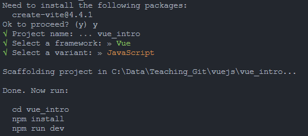

# **Vue Intro Project**

## **สร้างโปรเจ็คใหม่**
สร้างโปรเจ็คใหม่โดยใช้คำสั่งดังนี้
```
npm create vite@latest
```

หรือ

```
yarn create vite
```

เลือกโปรเจ็ค vue โดยใช้ JavaScript ชื่อโปรเจ็ค vue_intro ตามภาพ




**1) สร้าง folder ชื่อว่า images ในกล่อง Public**

**2) โหลดไฟล์ major4.webp และ major4.jpg จาก repository นี้ในกล่อง images ไปไว้ยังกล่อง Public/images ที่สร้างไว้ในข้อ 2**


**3) ทำการลบข้อมูลและเริ่มโครงสร้างใหม่สำหรับไฟล์ App.vue โดยใช้คำสั่ง vbase-3**


**4) ใช้ข้อมูลสินค้าตามที่ให้มาดังนี้ ( กำหนดในส่งของ data() )**
```
{
    product: 'หูฟังไร้สาย Marshall Major IV',
    brand: 'Marshall',
    image: './images/major4.webp',
    description: 'หูฟังจาก Marshall ในรุ่น Major IV เป็นหูฟังไร้สายชนิด on ear รุ่นที่ 4 แล้วครับ โดยในรุ่นนี้จะออกแบบให้สวมใส่สบายมากขึ้น พร้อมแบตเตอรี่ที่สามารถใช้งานได้นานสูงสุดถึง 80 ชั่วโมงเลยทีเดียว',
    url: 'https://www.marshallheadphones.com',
    inStock: true,
    inventory: 20,
    details: ['Wired', 'Wireless'],
    variants: [
        {id: 239, color: 'Black', image: './images/major4.webp'},
        {id: 240, color: 'Brown', image: './images/major4.jpg'},
    ],
    cart: 0
}
```

**5) แก้ไข style.css ดังนี้**
```
@import url('https://fonts.googleapis.com/css2?family=IBM+Plex+Sans+Thai:wght@100;200;300;400;500;600;700&display=swap');

body {
  background-color: #f2f2f2;
  margin: 0px;
  font-family: 'IBM Plex Sans Thai', sans-serif;
  color: #282828;
}

.button {
  margin: 30px 0px;
  background-color: #39495c;
  border-radius: 5px;
  font-size: 18px;
  color: white;
  padding: 10px 20px;
  text-align: center;
  cursor: pointer;
}

.cart {
  font-weight: bold;
  width: 25px;
  height: 25px;
  margin: 25px 100px;
  float: right;
  text-align: center;
  border-radius: 50%;
  border: 1px solid #d8d8d8;
  padding: 10px;
  background-color: #07c0f8;
  -webkit-box-shadow: 0px 2px 15px -12px rgba(0, 0, 0, 0.57);
  -moz-box-shadow: 0px 2px 15px -12px rgba(0, 0, 0, 0.57);
  box-shadow: 2px 15px -12px rgba(0, 0, 0, 0.57);
}

.color-circle {
  width: 50px;
  height: 50px;
  margin-top: 8px;
  border: 2px solid #d8d8d8;
  border-radius: 50%;
  display: inline-block;
}


.disabledButton {
  background-color: #d8d8d8;
  cursor: not-allowed;
}

h1 {
  font-size: 50px;
}

h3 {
  font-size: 25px;
}

img {
  border: 1px solid #7a798b9c;
  width: 70%;
  margin: 40px;
  padding: 0px;
  -webkit-box-shadow: 0px 2px 15px -12px rgba(0, 0, 0, 0.57);
  -moz-box-shadow: 0px 2px 15px -12px rgba(0, 0, 0, 0.57);
  box-shadow: 2px 15px -12px rgba(0, 0, 0, 0.57);
}

a{
  text-decoration: none;
  color: #0c6eee;
  font-weight: bold;
  font-size: 18px;
}


label {
  font-size: 20px;
  margin-bottom: 5px;
}

li {
  font-size: 20px;
  font-style: italic;
}

p {
  font-size: 22px;
}

.product-display {
  display: flex;
  flex-direction: column;
  padding: 1rem;
}

.product-container {
  display: flex;
  flex-direction: row;
  flex-wrap: wrap;
}

.product-image,
.product-info {
  width: 50%;
}


@media only screen and (max-width: 600px) {
  .container {
    flex-direction: column;
  }

  .product-image,
  .product-info {
    margin-left: 10px;
    width: 100%;
  }


}
```

**6) กำหนดส่วน template ดังนี้**
```
<template>
  <div class="cart"> 0 </div>

  <div class="product-display">
    <div class="product-container">
      <div class="product-image">

        
      </div>

      <div class="product-info">
        <h1> title </h1>
        <p> description </p>
        <p >In Stock</p>


        <ul>
          <li > detail </li>
        </ul>

        <div
          class="color-circle"
        >

        </div>

        <div>
          <button
            class="button"
          >
            Add to Cart
          </button>
        </div>

        <a href="#">Made by Marshall</a>
      </div>
    </div>
  </div>
</template>
```


## **Options API**
ใน Options API จะมีการกำหนดส่วนต่าง ๆ ในรูปแบบของ Object ของ Options เช่น data, methods, computed หรือ watch การอ้างอิงถึงข้อมูลใน Object จะใช้ this ในการอ้างอิง เช่น การเรียกภายใน function ตัวอย่างโครงสร้างของ .vue ใน Options API ดังนี้

```
<script>
export default {
  // Properties returned from data() become reactive state
  // and will be exposed on `this`.
  data() {
    return {
      count: 0
    }
  },

  // Methods are functions that mutate state and trigger updates.
  // They can be bound as event handlers in templates.
  methods: {
    increment() {
      this.count++
    }
  },

  // Lifecycle hooks are called at different stages
  // of a component's lifecycle.
  // This function will be called when the component is mounted.
  mounted() {
    console.log(`The initial count is ${this.count}.`)
  }
}
</script>

<template>
  <button @click="increment">Count is: {{ count }}</button>
</template>
```

การเรียกใช้ snippet เพื่อสร้างโครงสร้างของ .vue ใน Options API สามารถใช้คำสั่งต่อไปนี้ได้

```
vbase-3
```


## **Composition API**
รูปแบบของ Composition API จะเป็นการแยกส่วนต่าง ๆ ของ Component ออกมาเป็นฟังก์ชันที่สามารถนำไปใช้ซ้ำได้ โดยใช้คำสั่งต่อไปนี้

```
<script setup>
import { ref, onMounted } from 'vue'

// reactive state
const count = ref(0)

// functions that mutate state and trigger updates
function increment() {
  count.value++
}

// lifecycle hooks
onMounted(() => {
  console.log(`The initial count is ${count.value}.`)
})
</script>

<template>
  <button @click="increment">Count is: {{ count }}</button>
</template>
```


การเรียกใช้ snippet เพื่อสร้างโครงสร้างของ .vue ใน Composition API สามารถใช้คำสั่งต่อไปนี้ได้

```
vbase-3-setup
```

อ้างอิง https://vuejs.org

## **LAB**
* การใช้ Text Interpolation (Mustache Syntax)
* การใช้ Attribute Bindings (v-bind)
* การใช้ Class Binding (v-bind:class)
* การใช้ Methods
* รู้จักกับ Directives (v-bind, v-on, v-if, v-else, v-for, v-model)
* การใช้ Event Handling (v-on)
* การใช้ v-if และ v-else
* การใช้ v-for 
* การใช้ Two-way Binding (v-model)
* การใช้ Compute Properties (computed)
* การใช้ ref()
